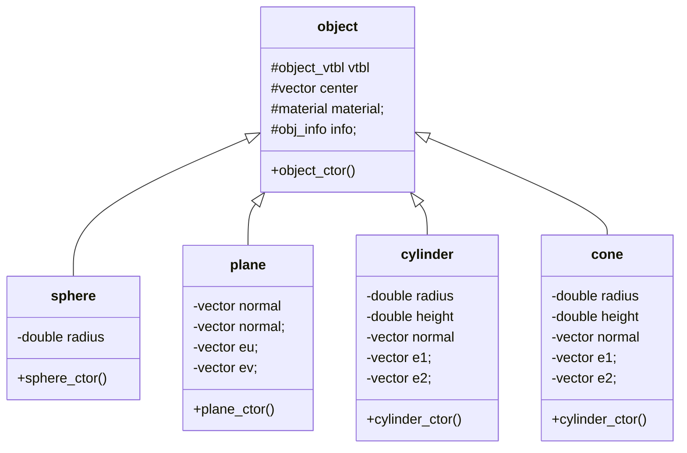
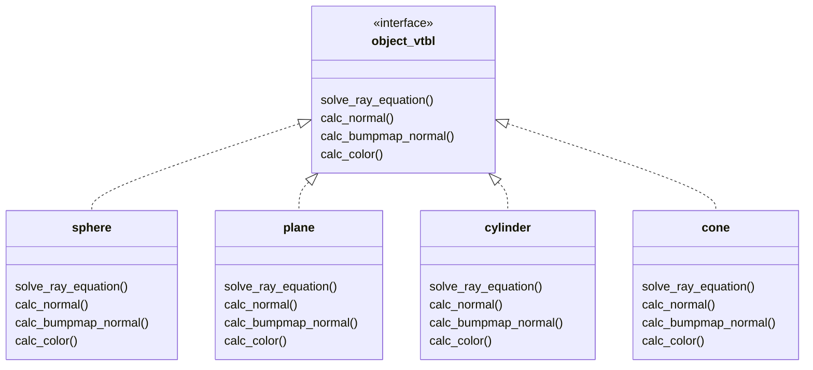

*日本語版はREADMEは[こちら](https://github.com/moromin/miniRT/blob/master/README.md)

# miniRT

## Summary

Simple Ray Tracer in C

## Demo

`scenes/texture.rt`


`scenes/bumpmap.rt`


`scenes_bonus/ch_multi.rt`


## Installation

### Requirement
- GNU make (version 3.81)
- GCC (Apple clang version 13.0.0)


Used these versions during development.

### Mac/Linux

- [MinilibX](https://github.com/42Paris/minilibx-linux/) (X-Window (X11R6) programming API in C)

```bash
git clone https://github.com/moromin/miniRT --recursive
cd miniRT
make
./miniRT [RTFILE_PATH]
```

## Features
- Read environment and object information from rt file
    - More details are provided below!
- The following can be placed at any position
    - Geometric objects
    - Light sources
    - Viewpoint
- Geometric object
    - Sphere
    - Plane
    - Cylinder
    - Cone
- Light source
    - Point light source
    - Spotlight (angle can be specified)
- Extra
    - Ambient light
    - Diffuse reflection
    - Specular reflection
    - Checker pattern
    - Bump mapping
    - Texture mapping

## Where we worked hard
### Used single inheritance and performed OOP in C




```c
// include/object.h

typedef struct s_object_vtbl	t_object_vtbl;

typedef struct s_object {
	// virtual method table
	t_object_vtbl	*vptr;
	t_vector		center;
	t_material		material;
}	t_object;

struct s_object_vtbl {
	double		(*solve_ray_equation)(t_object *const me, t_ray);
	t_color		(*calc_radiance)(t_object * const me, t_vector, t_light, t_vector);
	t_vector	(*calc_normal)(t_object * const me, t_vector　cross_point);
	t_color		(*calc_color)(t_object * const me, t_vector cross_point);
};
```

```c
// include/object.h

typedef struct s_sphere {
	// inherit t_object
	t_object	super;
	// field specific to t_sphere
	double		radius;
}	t_sphere;
```

### Implemented variable-length arrays with reference to slice in Go

*Features like `s[1:2]` were not needed this time + memory management became too complicated, so they are not implemented this time.

```c
// include/slice.h

// Encapsulation by forward declaration
typedef struct s_slice	t_slice;

t_slice	*make(size_t size, size_t len, size_t cap);
void	delete(t_slice *s);
void	append(t_slice *s, void *elem);
void	*get(t_slice *s, int index);
size_t	len(t_slice *s);
```

```c
// src/slice.c

void	append(t_slice *s, void *elem)
{
	t_slice	*new;

	if (s->len < s->cap)
	{
		ft_memcpy(s->org_start + s->len * s->size, elem, s->size);
		s->len++;
	}
	else
	{
		new = x_malloc(s->size * s->cap * 2);
		ft_memcpy(new, s->cur_start, s->size * s->len);
		free(s->org_start);
		s->cap *= 2;
		s->org_start = new;
		s->cur_start = new;
		append(s, elem);
	}
}
```


## `rt` file
This RayTracing program renders based on `rt` files.The format of the `rt` file is defined as follows:

```
{identifier} {param1} {param2} ...
```

Example
```
A 0.2 255,255,255

C -50,0,20 0,0,0 70
L -40,0,30 0.7 255,255,255

pl 0,0,0 0,1.0,0 255,0,225
sp 0,0,20 20 255,0,0
cy 50.0,0.0,20.6 0,0,1.0 14.2 21.42 10,0,255
```

The parameters for each identifier are set as follows:
#### A (Ambient)
```
A {ratio} {color}
```
- `ratio` : ratio in range `[0.0, 1.0]`.
- `color` : color in range `[0.0, 255.0]` for each `R,G,B`.

#### C (Camera)
```
C {view_point} {orientation_vector} {FOV}
```
- `view_point` : coordinates of view point in `x,y,z` format.
- `orientation_vector` : normalized orientation vector in range `[-1, 1]` for each `x,y,z` axis.
- `FOV` : horizontal field of view in degrees in range `[0, 180]`.

#### L (Light)
```
L {point} {ratio} {color}
```
- `point` : coordinates of point in `x,y,z` format.
- `ratio` : ratio in range `[0.0, 1.0]`.
- `color` : color in range `[0.0, 255.0]` for each `R,G,B` (unused in mandatory part).

#### sp (Sphere)
```
sp {center} {diameter} {color}
```
- `center` : coordinates of center in `x,y,z` format.
- `diameter` : diameter of the sphere.
- `color` : color in range `[0.0, 255.0]` for each `R,G,B`.


#### pl (Plane)
```
pl {center} {orientation_vector} {color}
```
- `center` : coordinates of center in `x,y,z` format.
- `orientation_vector` : normalized orientation vector in range `[-1, 1]` for each `x,y,z` axis.
- `color` : color in range `[0.0, 255.0]` for each `R,G,B`.

#### cy (Cylinder)
```
cy {center} {orientation_vector} {diameter} {height} {color}
```
- `center` : coordinates of center in `x,y,z` format.
- `orientation_vector` : normalized orientation vector in range `[-1, 1]` for each `x,y,z` axis.
- `orientation_vector` : normalized orientation vector in range `[-1, 1]` for each `x,y,z` axis.
- `diameter` : diameter of the cylinder.
- `height` : height of the cylinder.
- `color` : color in range `[0.0, 255.0]` for each `R,G,B`.

#### co (Cone)
```
co {center} {direction} {aperture} {color}
```
- `center` : coordinates of top in `x,y,z` format.
- `orientation_vector` : normalized orientation vector in range `[-1, 1]` for each `x,y,z` axis.
- `aperture` : aperture angle of cone.
- `color` : color in range `[0.0, 255.0]` for each `R,G,B`.

#### bm (Bump map)
```
bm {file_path} {vertical_repetition} {horizontal_repetition}
```
- `file_path` : file path of bump map (normal map)
- `horizontal_repetition` : number of horizontal repetitions
- `vertical_repetition` : number of vertical repetitions

#### tx (Texture)
```
tx {file_path} {vertical_repetition} {horizontal_repetition}
```
- `file_path` : file path of texture
- `horizontal_repetition` : number of horizontal repetitions
- `vertical_repetition` : number of vertical repetitions

## Authors
- [tacomeet](https://github.com/tacomeet)
- [moromin](https://github.com/moromin)
## References
- [C言語でレイトレーシングプログラムを作った](https://jun-networks.hatenablog.com/entry/2021/04/02/043216)
- [The Textbook of RayTracing @TDU](https://knzw.tech/raytracing/?page_id=1154)
- [Application Note Object-Oriented Programming in C](https://www.state-machine.com/doc/AN_Simple_OOP_in_C.pdf)
- [Texture Mapping](http://www.raytracerchallenge.com/bonus/texture-mapping.html) (from *[The Ray Tracer Challenge](http://www.raytracerchallenge.com/))*
- [kohkubo/minirt_sample](https://github.com/kohkubo/minirt_sample)
- yokawada氏notion
